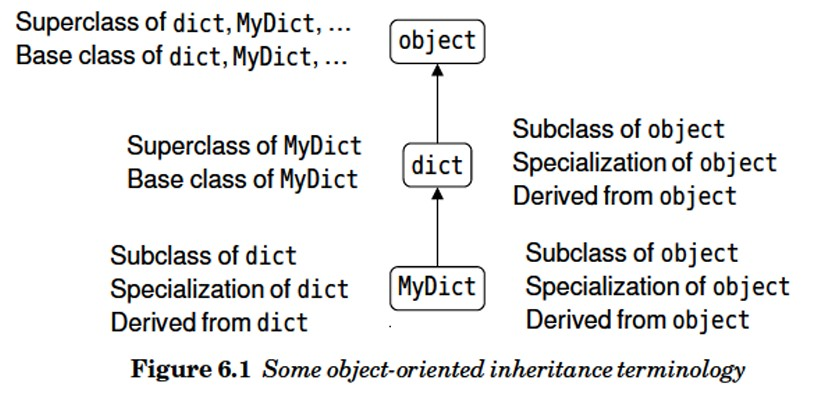
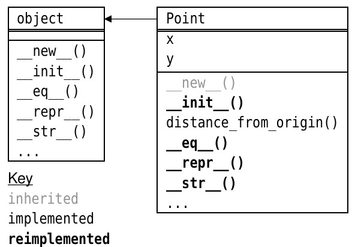

En python existen métodos especiales que inician con doble guión bajo, los cuales permiten realizar
operaciónes con los simbolos de los operadores + - * / (escritos como __add__() y __sub__() por ejemplo), lo cual es lo más similar a sobrecargar los operadores en la programación orientada a objetos.
Existen atributos que tienen "propiedades", las cuales son métodos que actuan sobre las obejetos de datos (variables) y que tras escena manejan la forma en la que se accede a estos objetos lo que permite la validación de los datos.
El siguiente es un diagrama de como estan estructuradas las clases en Python:



Sintaxis para crear clases personalizadas:
```
class className:
    suite
class className(base_classes):
    suite
```
el siguiente programa:
[Shapes.py](./ShapeV1.py) 

cuyo diagra de clases se muestra a continuación:


returna los siguientes valores:
```
>>> import ShapeV1
>>> a = Shape.Point()
>>> repr(a)
'Point(0,0)'
>>> b= Shape.Point(3,4) 
>>> str(b)
'(3,4)'
>>> b.distance_from_origin()
5.0
>>> b.x = -19
>>> str(b)
'(-19,4)'
>>> a == b, a != b
(False, True)
>>>
```
Agreamos una clase Circle que tiene como padre la clase Point

Ejemplos del uso del nuevo programa:
```
>>> p = Shape.Point(28, 45)    
>>> c = Shape.Circle(5, 28, 45)
>>> p.distance_from_origin()   
53.0
>>> c.distance_from_origin()
53.0
```
Podemos reescribir el programa usando "Propierties"
[Shapes.py](./ShapeALT.py)
y nos dara los siguientes resultados:
```
>>> import ShapeAlt as Shape
>>> circle = Shape.Circle(5, 28, 45)
>>> circle.radius
5
>>> circle.edge_distance_from_origin
48.0
```
la diferencia radica en que al proporcionar solo Getters hara que las propiedas sean solo de lectura, note que no necesitamos usar los parentesis al final de los métodos.
también es posible declarar un decorador solo lectura usando la siguiente sintaxis;
```
def area(self):
    return math.pi * (self.radius ** 2)
area = property(area)
```

```
>>> import ShapeAlt as Shape
>>> Circle = Shape.Circle(5, 28, 45) 
>>> Circle = Shape.Circle(-5, 28, 45)
Traceback (most recent call last):
  File "<stdin>", line 1, in <module>
    Circle = Shape.Circle(-5, 28, 45)
  File "C:\Users\sambo\Documents\Programacion\GitHub\python\OOP\Practicas\ShapeAlt.py", line 18, in __init__
    self.radius = radius
    ^^^^^^^^^^^
  File "C:\Users\sambo\Documents\Programacion\GitHub\python\OOP\Practicas\ShapeAlt.py", line 53, in radius
    assert radius >= 0, "Radius must be nonzero and non-negative"
           ^^^^^^^^^^^
AssertionError: Radius must be nonzero and non-negative
>>> Circle.radius                    
5
```
